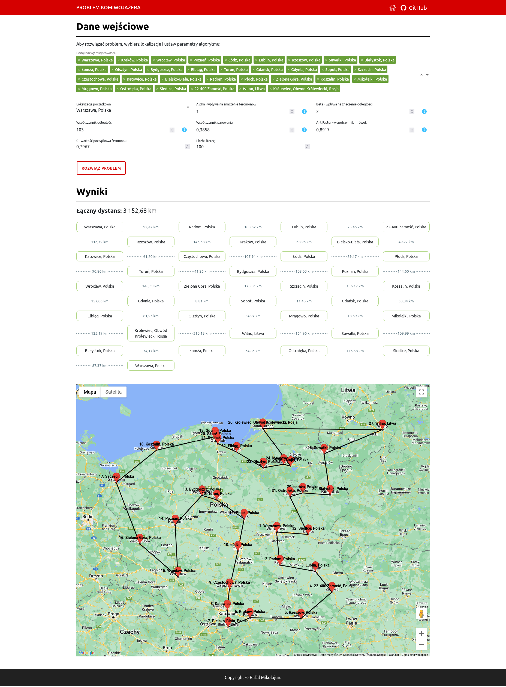

# symfony-tsp-application

An application that uses the ant algorithm to solve the traveling salesman problem (TSP).

The application is designed to find the optimal route by visiting all cities exactly once and returning to the starting city, minimizing the total distance traveled during the trip.

## Most important classes

* [GeoDistance](./src/Module/Distance/Application/Math/GeoDistance.php)
* [DistanceMapFactory](./src/Module/Distance/Application/Factory/DistanceMapFactory.php)
* [PheromoneMatrix](./src/Module/TSP/Application/Problem/PheromoneMatrix.php)
* [SalesmanAnt](./src/Module/TSP/Application/Problem/SalesmanAnt.php)
* [AntColonyOptimization](./src/Module/TSP/Application/Problem/AntColonyOptimization.php)

## Example of usage in code

For a complete usage example, see the class:

* [AskForProblemSolutionHandler](./src/Module/TSP/Application/Interaction/AskForProblemSolutionQuery/Handler/AskForProblemSolutionHandler.php)

## API usage example

To resolve the TSP problem, use the following method:

`POST {{ baseUrl }}/api/tsp/solve`

JSON Body:

```json
{
    "iterations": 100,
    "initialLocationIndex": 0,
    "alpha": 1.0,
    "beta": 2.0,
    "distanceCoefficient": 103,
    "evaporation": 0.3858,
    "antFactor": 0.8917,
    "c": 0.7967,
    "locations": [
        {
            "lat": 52.228335194897305,
            "lng": 21.024282381375762,
            "name": "Warszawa"
        },
        {
            "lat": 50.07441120406187,
            "lng": 19.918273393012594,
            "name": "Kraków"
        },
        {
            "lat": 51.12409338222792,
            "lng": 17.028842839711565,
            "name": "Wrocław"
        },
        {
            "lat": 53.77693249670846,
            "lng": 20.480296608541163,
            "name": "Olsztyn"
        },
        {
            "lat": 53.42671867480122,
            "lng": 14.536716299792118,
            "name": "Szczecin"
        },
        {
            "lat": 53.130865428178524,
            "lng": 23.16610165182039,
            "name": "Białystok"
        },
        {
            "lat": 50.811012584653966,
            "lng": 19.11830141901638,
            "name": "Częstochowa"
        },
        {
            "lat": 54.36451994638047,
            "lng": 18.64580473617786,
            "name": "Gdańsk"
        },
        {
            "lat": 52.41391635101633,
            "lng": 16.931845710832814,
            "name": "Poznań"
        },
        {
            "lat": 53.016850513186284,
            "lng": 18.604181525471216,
            "name": "Toruń"
        },
        {
            "lat": 54.541025621722184,
            "lng": 18.524949921520708,
            "name": "Gdynia"
        },
        {
            "lat": 51.315313230026035,
            "lng": 22.606483789824047,
            "name": "Lublin"
        },
        {
            "lat": 53.835969079031415,
            "lng": 20.475017464328243,
            "name": "Dywity"
        },
        {
            "lat": 53.986715221744525,
            "lng": 20.39720594995499,
            "name": "Dobre Miasto"
        },
        {
            "lat": 54.01076187804673,
            "lng": 20.081378370435193,
            "name": "Miłakowo"
        }
    ]
}
```

## Screenshot



## Copyrights

Copyright © Rafał Mikołajun 2024.
